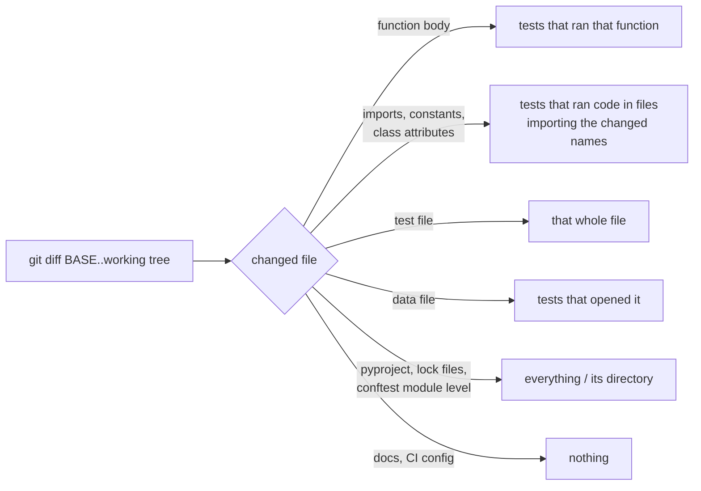

# testpick

**Run only the tests your change can affect.** testpick records, once, which functions and
files every test uses. For each pull request it reads the git diff, works out which of those
the change touched, and runs just those tests, most-likely-to-fail first. It tells you why
each test was picked, and which changed code no test runs at all.

```console
$ pytest --testpick-record            # once on main (nightly, or in CI after each merge)
$ pytest --testpick=origin/main       # on your branch
...
testpick: running 82 of 1294 tests
```

Replaying 55 real commits of two open-source projects, testpick needed 30% of the test time,
and caught all 63 planted bugs that the full suite caught ([details](#does-it-miss-bugs)).

## Install

```console
pip install testpick        # Python 3.10+, pytest 8.2+
```

The plugin is inactive unless you pass one of its options.

| | |
|---|---|
| `pytest --testpick-record` | run the suite, recording what each test uses into `.testpick/map.json.gz` (works with `-n auto`) |
| `pytest --testpick=BASE` | run only tests affected by changes since `BASE` (a branch, tag or commit), including uncommitted and untracked files |
| `pytest --testpick=BASE --testpick-record` | ...and refresh those tests' entries in the map |
| `--testpick-no-reorder` | keep pytest's order |
| `testpick select --base BASE` | list what would run and why (`--json`, `--list`) |
| `testpick explain TEST --base BASE` | why one test would or wouldn't run |
| `testpick shard --n 4 --i 0` | split the suite across machines by recorded time |

See [docs/github-actions.md](docs/github-actions.md) for a CI setup that records the map on
`main` and uses it on pull requests.

```console
$ testpick select --base origin/main
453 of 1294 tests, about 55.2s of 108.3s (51% of the suite's time)
  tests/dialects/test_snowflake.py: changed, runs whole
  sqlglot/dialects/snowflake.py module level (Snowflake): 191 tests
  sqlglot/expressions/array.py module level (SplitToTable): 182 tests
  sqlglot/optimizer/qualify_tables.py::qualify_tables: 155 tests
  tests/fixtures/optimizer/qualify_tables.sql (read by these tests): 1 tests
```

## How it decides



**Recording.** On Python 3.12+ the recorder uses `sys.monitoring` (PEP 669). The first call
of each function in a test fires one callback; that call site is then switched off until the
next test starts. The cost is one callback per function per test, not one per executed line
as with per-test coverage. Functions are stored by qualified name (`Parser._parse_alter`), so
a map recorded days ago still matches code whose line numbers have moved. An audit hook on
`open` records the files each test reads. Python 3.10–3.11 fall back to `sys.setprofile`.

**Reading the diff.** Removed lines are looked up in the old version of a file, added lines
in the new one. A function counts as changed only if its syntax tree changed, so
reformatting, comments and blank lines pick nothing.

**Module-level changes** (imports, constants, class attributes) can't be traced to a single
function. testpick finds the names those statements define and follows the import graph:
files that do `from mod import NAME`, or import `mod` and read `mod.NAME`, including
re-exports through a package's `__init__.py`. Tests that ran code in any of those files are
picked.

**Always safe to skip?** No tool can promise that, so testpick leans conservative:

- tests the map hasn't seen (new tests, renamed tests, new parameters) always run;
- changes to packaging and test config (`pyproject.toml`, lock files, `pytest.ini`) run
  everything, and a module-level change in `conftest.py` runs its directory;
- module-level changes that nothing recorded uses run everything (unless no file imports
  the file at all: then it's a script or a `.py` file used as data, and only its readers run);
- if the map isn't from an ancestor of `BASE`, testpick warns.

Configure in `pyproject.toml`:

```toml
[tool.testpick]
map = ".testpick/map.json.gz"
run_all = ["Makefile"]              # added to the defaults
ignore = ["*.md", "docs/*"]         # files never worth a note
test_files = ["test_*.py", "*_test.py"]
```

## Does it miss bugs?

`bench/evaluate.py` replays real history. For each commit it picks tests using one map
recorded before the first commit (as a nightly map would be), then plants small bugs on
lines the commit changed: a flipped comparison, `and`/`or` swapped, an altered string or
number, `return None`. Each bug runs against the picked tests through the pytest plugin.
If they miss it, the full suite runs too, to separate a real miss from a bug no test in the
project can see.

Both projects, one map each, recorded at the commit before the first one replayed
(`results/v2/*.json`, summarized by `bench/summarize.py`; 2-CPU Linux container, Python 3.13):

| | [sqlglot](https://github.com/tobymao/sqlglot) (SQL parser) | [black](https://github.com/psf/black) (code formatter) |
|---|---|---|
| Tests in the suite | 1,294 (plus 20,000+ subtests) | 558 |
| Commits replayed | 30 (Sept 30 – Oct 2, 2026) | 25 (Sept 16 – Sept 30, 2026) |
| Test time picked, all commits together | **27%** of the full suite | **36%** |
| ...a simpler "tests touching any changed file" rule | 38% | 61% |
| Median commit | 7% | 7% |
| Commits needing no tests (docs, CI, changelog) | 11 | 7 |
| Commits where testpick ran everything | 1 (module-level change it couldn't trace) | 0 |
| Planted bugs | 53 | 41 |
| ...that the full suite catches | 33 | 30 |
| ...**also caught by the picked tests** | **33 of 33** | **30 of 30** |
| ...no test in the project catches | 20 | 11 |

The bugs no test catches are worth a look on their own: most are altered strings and
constants in code paths the suites don't check. `testpick select` lists such changed
functions under "not run by any test".

Black is a good stress test for data files: its tests are driven by hundreds of `.py`
files read as test cases. A changed case file runs only the test that reads it, and a new
one shows up as a new test parameter, which always runs.

## Recording overhead

Full test suite, run twice each, back to back (`results/v2/overhead.txt`):

| | plain pytest | `--testpick-record` | per-test line coverage (`pytest-cov --cov-context=test`) |
|---|---|---|---|
| sqlglot | 96.0 s | 102.7 s (**+7%**) | 260.5 s (+171%) |
| black | 63.9 s | 72.7 s (**+14%**) | 219.0 s (+243%) |

The first version of testpick recorded with per-test line coverage. Switching to
`sys.monitoring` function entries is what made recording cheap enough to do on every merge.

A bug found by the replay: running likely failures first originally moved single tests
between classes and modules, so pytest kept tearing down and rebuilding class and module
fixtures. A 1,268-test selection on sqlglot took 181 s instead of 99 s. Whole classes and
modules now move together.

## Compared with pytest-testmon

[pytest-testmon](https://github.com/tarpas/pytest-testmon) is the established tool for
this, and worth a look. It tracks changes locally between your own runs, using per-test
line coverage and fingerprints of code blocks, kept in a local database. testpick is built
around a different workflow: one map recorded on `main`, reused by every branch and CI job,
and selection from a git diff. It also traces data files and module-level changes through
imports, and explains each choice.

## Limitations

- Behaviour that doesn't go through a Python function call isn't seen: C extensions
  reading files, subprocesses, network services, environment variables.
- Work done once per process is credited to the first test that triggers it: a cached
  result (`functools.cache`), a lazily built table. Other tests that use the cached value
  depend on that code without the map knowing. Recording with `-n auto` spreads this over
  several processes; refreshing the map regularly keeps it small.
- Dynamic lookups (`getattr` with computed names, `importlib.import_module` on strings)
  aren't followed by the import graph.
- Run pytest from the repository root.

## Development

```console
pip install -e ".[dev]"
pytest              # 31 tests, mostly end-to-end runs in throwaway git repos
                    # (tested on Python 3.10–3.13, locally and in CI)
ruff check . && mypy
```

MIT licensed.
